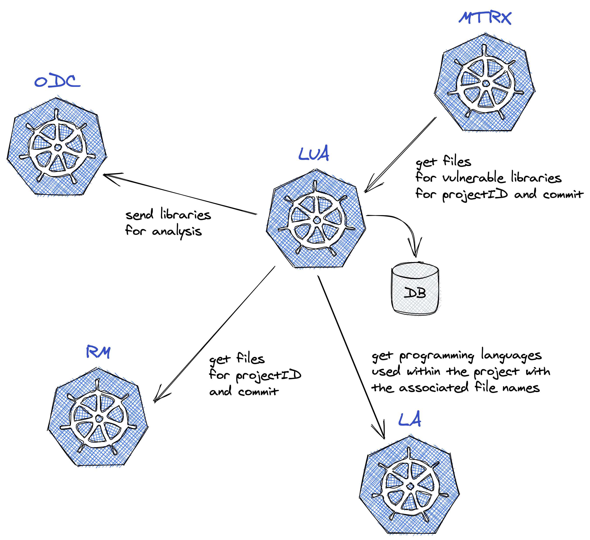
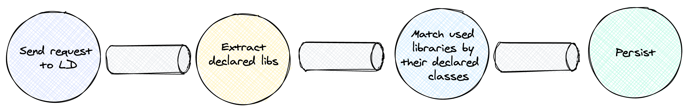

# LUA - Library Usage Analyser

 

LUA was developed to analyze the usage of third-party libraries across a project. It provides information about what exact files from the project are using a specific library.

## How it works?

LUA integrates with:
* [RM](https://github.com/iantal/rm) - downloads the project files via REST API for a project and its commit
* [LD](https://github.com/iantal/ld) - gets the list of programming languages used withing the project and also the list of file names for each langauge
* [ODC](https://github.com/iantal/odc) - sends the extracted libraries for analysis
* [MTRX](https://github.com/iantal/mtrx) - provides information about libraires via GPPC calls

The processing in LUA is done using a pipeline with the help of go channels.

For each projectID and commit, it gets the files and their programming language from LD. Having this information, it downloads the libraries and extracts their classes. Currently, only Java files are analyzed.

The most important part of the processing is the matching step. It is linking a file to a specific library based on the imported classes from it.

